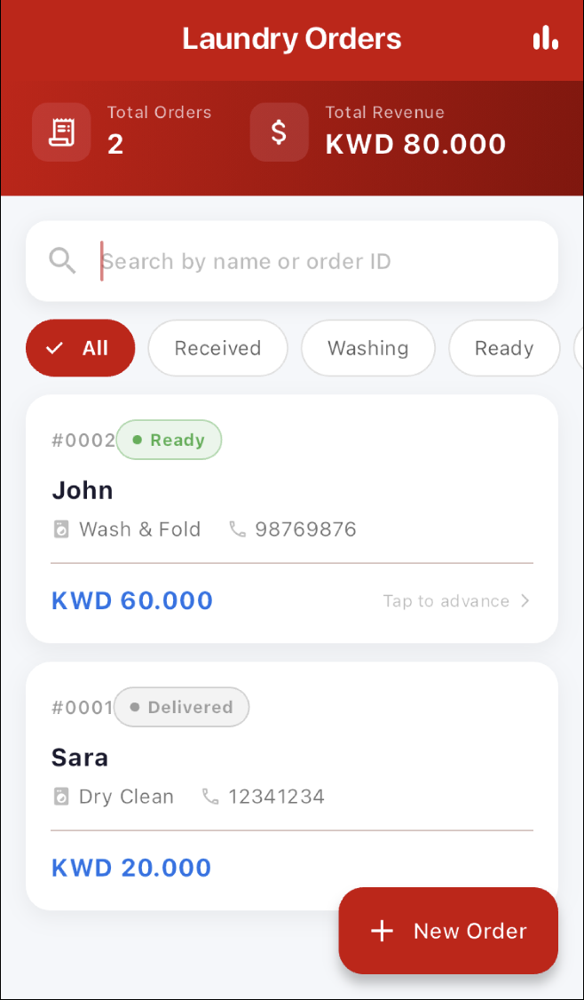
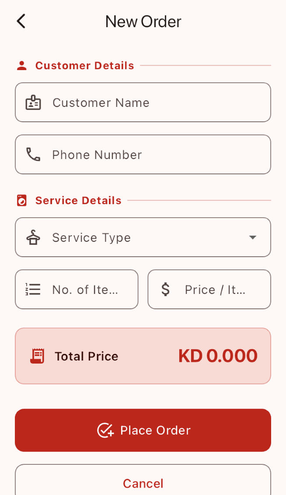

# Laundry Order Management App

A Flutter mobile application for managing laundry service orders. The app supports creating and tracking orders, advancing order status through a defined workflow, searching and filtering, and viewing a live revenue dashboard.

---

## Prerequisites

| Requirement | Version |
|---|---|
| Flutter SDK | ≥ 3.19.0 |
| Dart | ≥ 3.3.0 |
| Android Studio / Xcode | Latest stable |
| Device / Emulator | Android API 21+ or iOS 13+ |

---

## How to Run

```bash
# 1. Clone the repo
git clone https://github.com/venetiafaber/flutter-laundry-orders.git
cd flutter-laundry-orders

# 2. Install dependencies
flutter pub get

# 3. Run the app
flutter run
```

> ⚠️ **Schema changes:** If the database schema is modified (e.g. a column is added), delete the app from your device or emulator before running again. SQLite does not auto-migrate — the old database file will persist on-device and cause errors if the schema has changed.

---

## Database Structure

Table name: **`orders`**

| Column | Type | Purpose |
|---|---|---|
| `id` | INTEGER PRIMARY KEY AUTOINCREMENT | Unique order identifier |
| `customerName` | TEXT NOT NULL | Full name of the customer |
| `phoneNumber` | TEXT NOT NULL | Customer contact number |
| `serviceType` | TEXT NOT NULL | One of: Wash & Fold, Dry Clean, Iron Only, Wash & Iron |
| `numberOfItems` | INTEGER NOT NULL | Count of laundry items |
| `pricePerItem` | REAL NOT NULL | Cost per individual item |
| `totalPrice` | REAL NOT NULL | Auto-calculated: numberOfItems × pricePerItem |
| `status` | TEXT NOT NULL | Workflow state: Received → Washing → Ready → Delivered |

---

## Features

- 📋 Orders list screen displaying all order fields (ID, Customer, Phone, Service, Status, Total Price)
- ➕ Add new order form with Customer Name, Phone Number, Service Type, Number of Items, and Price per Item
- 💰 Auto-calculated total price with live preview in the form
- 🔄 Status advancement: Received → Washing → Ready → Delivered (tap to advance)
- 🔍 Search orders by Customer Name or Order ID
- 🗂️ Filter orders by status (chip bar)
- 📊 Dashboard banner showing total orders and total revenue
- ✅ Form validation (required fields, digits-only phone, positive numbers)

---

## Project Structure

```
lib/
├── main.dart                  # App entry point, Provider setup, named routes
├── models/
│   └── order.dart             # Order data class, toMap/fromMap, copyWith
├── db/
│   └── database_helper.dart   # SQLite singleton, all CRUD operations
├── providers/
│   └── order_provider.dart    # ChangeNotifier, business logic, app state
└── screens/
    ├── orders_list.dart       # Main screen: dashboard, search, filter, list
    └── add_order.dart         # Add order form with validation
```

### Architecture

The app is organised into three layers:

- **Data layer** (`db/`) — handles all raw SQLite read/write operations
- **Logic layer** (`providers/`) — applies business rules, holds app state, and notifies the UI of changes
- **UI layer** (`screens/`) — reads from the Provider and dispatches user actions

---

## Screenshots

| Orders List | Add Order
|---|---
|  | 